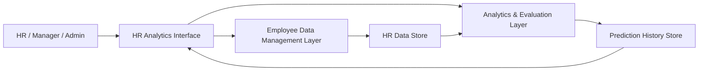

# 🧠 HR Analytics System – Concept & Design

### A concept-level HR Analytics platform that uses structured data and analytical logic to assess employee attrition risk and performance levels for better workforce decision-making.

 

---

## 🔍 Concept Overview

The **HR Analytics System** is a **design-level concept** for an internal platform that helps organizations **understand, monitor, and predict** employee behavior and outcomes using structured HR data.

Instead of focusing on implementation details, this concept highlights **what** the system does and **how** it should behave from a functional and architectural perspective, including employee management, attrition risk estimation, performance insights, and auditability.

---

## 🎯 Objectives

The system is envisioned to:

- Identify employees with **potential attrition risk**
- Classify employees into **performance levels** (Low / Medium / High)
- Provide **department-wise and organization-level insights**
- Maintain a **history of predictions** for compliance and analysis
- Support **secure access** and controlled visibility of HR insights

---

## 🧩 Core Functional Capabilities

### 1. Employee Management

- Maintain a **central repository** of employee records
- Support:
  - Adding new employee profiles
  - Updating existing employee information
  - Deactivating or logically removing records
- Capture data such as:
  - Demographics
  - Job role and department
  - Compensation bands
  - Tenure and promotion history
  - Work–life and satisfaction indicators

### 2. Attrition Risk Assessment

- Provide **risk classification** for each employee (e.g., Stay vs Leave tendency)
- Display **confidence levels** or risk intensity indicators
- Surface **key drivers** contributing to higher risk segments (e.g., low satisfaction, high overtime, low promotion rate)

### 3. Performance Level Insights

- Classify employees into **performance tiers** such as Low / Medium / High
- Help HR and managers:
  - Identify high performers
  - Target development plans for low performers
  - Balance performance distribution across departments

### 4. Real-time Analytics & Dashboards

- Present **visual summaries** of:
  - Attrition risk across departments
  - Performance distribution
  - Tenure bands vs risk
  - Promotions vs performance patterns
- Provide **filters** by department, role, location, etc.

### 5. Audit Trail & History

- Maintain a **prediction history log** for:
  - When an assessment was made
  - What the system predicted
  - Confidence or risk score at that time
- Support compliance, HR audits, and longitudinal analysis.

### 6. Secure Access

- Role-based login concept:
  - Admin / HR roles
  - Manager views
  - Restricted access to sensitive fields
- Emphasis on:
  - **Confidentiality of employee data**
  - Controlled exposure of sensitive analytic results

---

## 🏗 Conceptual Data Model (Design Level)

### Employees (Core Entity)

Fields include (conceptually):

- Employee ID
- Name
- Age
- Gender
- Department
- Job Role
- Salary band
- Years at Company
- Job Satisfaction level
- Work–life balance index
- Performance rating / band
- Promotion history count
- Overtime status

### Prediction History

- Unique record ID
- Linked Employee ID
- Prediction type:
  - Attrition / Performance
- Prediction result:
  - e.g., “High risk”, “Medium performance”
- Confidence or risk score
- Timestamp of prediction

### Users (Access Control)

- User ID
- Username
- Role (Admin / HR / Manager)
- Secure authentication information (concept level)

---

## 🧱 High-Level System Architecture

- **HR Analytics Interface**
  Conceptual front-end for employee views, dashboards, and insights.

- **Employee Data Management Layer**
  Handles structured employee records and profile management.

- **Analytics & Evaluation Layer**
  Applies analytical logic, rules, and models to derive:
  - Attrition risk
  - Performance tiers

- **HR Data Store**
  Centralized conceptual repository of employee and organizational data.

- **Prediction History Store**
  Keeps a record of historical analytics output for review and audits.

---

## 🛠 Skill Stack

| Area | Skills / Technologies |
|------|------------------------|
| **Programming Language** | Python [web:104] |
| **Web Framework** | Flask [web:104][web:109] |
| **Machine Learning** | Scikit-learn |
| **Database** | SQLite |
| **Frontend** | HTML, CSS, JavaScript [web:109][web:111] |
| **Version Control** | Git, GitHub |

---

## 🧠 Analytical Logic (Concept)

At a design level, the analytical engine is expected to:

- Use **structured HR attributes** as input
- Generate:
  - **Attrition risk classification** (e.g., Stay / Leave tendency)
  - **Performance grouping** (Low / Medium / High)
- Consider features such as:
  - Tenure, salary relative to peers, promotions
  - Overtime load, job satisfaction, work–life balance
  - Department-specific patterns

This block can later be implemented with an ML-driven analytics pipeline suitable for classification workflows.[web:104]

---

## 📊 Example Insights (Conceptual)

The system should be capable of surfacing:

- Departments with **high concentration of at-risk employees**
- Correlation between **overtime and attrition**
- How **performance distribution** changes over time
- Promotion policies vs **retention trends**
- Top factors influencing **high-risk segments**

These insights guide HR in:
- Policy changes
- Targeted retention programs
- Performance management strategies

---

## 🧭 User Flows (Design-Level)

### HR / Admin

- Add or update employee records
- View system-wide and department-level dashboards
- Review high-risk and low-performance segments
- Export or review historical analytic records

### Manager

- View team-specific metrics
- Identify team members needing support or recognition
- Use analytics to plan **reviews, training, and retention actions**

---

## 🚀 Future Roadmap (Concept)

As the design evolves into implementation, potential enhancements include:

- Integration with **live HRIS / payroll systems**
- Automated **alerting engine** for high-risk employees
- More advanced **scenario simulations**
- Support for **multi-location, multi-entity organizations**
- Extended **reporting and export**
- Integration with **engagement surveys** and feedback tools

---

## 🧠 Design Value

This HR Analytics System concept demonstrates:

- Structured **HR data modeling**
- Clear **separation of roles and views**
- Thoughtful **analytics integration** into HR workflows
- A web-based analytics direction consistent with Flask-backed applications and browser-based front ends.[web:104][web:109][web:111]

It serves as a strong conceptual foundation for building a **future production-ready HR analytics and decision-support platform**.

### Understand your workforce. Anticipate risk. Drive informed HR decisions.

